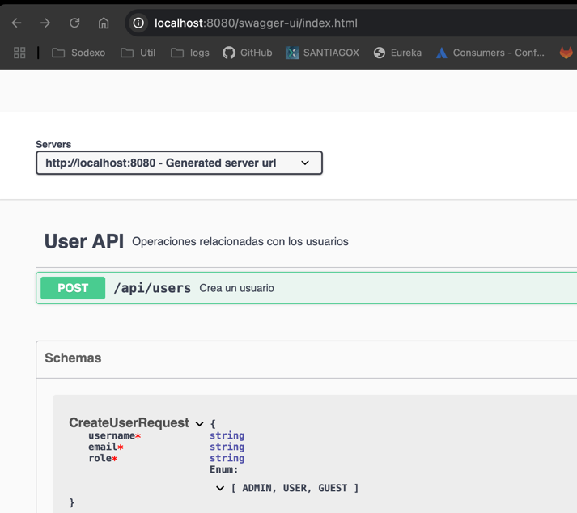
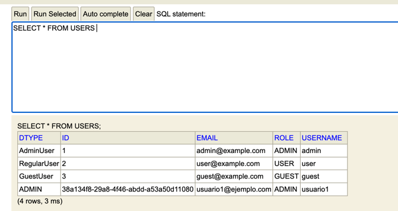

# API de Gestión de Usuarios

Este proyecto es una API RESTful para la gestión de usuarios desarrollada con Spring Boot 3.x y Java 17.

## Requisitos Previos

- Java JDK 17 o superior
- Maven 3.6.x o superior
- Un IDE de tu preferencia (IntelliJ IDEA, Eclipse, VS Code)

## Tecnologías Utilizadas

- Spring Boot 3.4.4
- Spring Data JPA
- Base de datos H2 (en memoria)
- Lombok
- SpringDoc OpenAPI (Swagger)
- Jakarta Validation

## Configuración y Ejecución

1. Clona el repositorio:
```bash
git clone [URL_DEL_REPOSITORIO]
```

2. Navega al directorio del proyecto:
```bash
cd solucion_desafio_1
```

3. Compila el proyecto:
```bash
mvn clean install
```

4. Ejecuta la aplicación:
```bash
mvn spring-boot:run
```

La aplicación estará disponible en [http://localhost:8080](http://localhost:8080).

## Documentación de la API

### Curl
```bash
curl --location 'http://localhost:8080/api/users' \
--header 'Content-Type: application/json' \
--data-raw '{
    "username": "usuario3",
    "email": "usuario3@ejemplo.com",
    "password": "Contraseña123!",
    "role": "GUEST"
}'
```

### Swagger UI
Puedes acceder a la documentación interactiva de la API
[swagger](http://localhost:8080/swagger-ui.html)

### Evidencias


